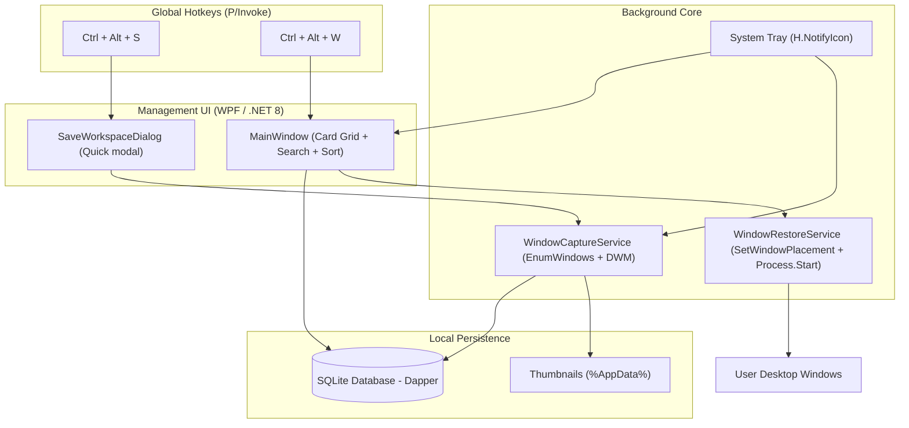

# ⚡ Workplace Saver

> Save your entire desktop workspace (all open applications, their window states, sizes, and precise screen positions) to a local database with a single keystroke, and restore them anytime through a sleek, modern desktop management interface.

---

## ✨ Features

- **📸 Instant Workspace Capture (`Ctrl + Alt + S`)**:
  - Automatically captures all active top-level application windows.
  - Filters out system background processes, cloaked UWP apps, and invisible helper windows using Raymond Chen's Alt-Tab algorithm.
  - Preserves exact multi-monitor screen bounds (`Left`, `Top`, `Width`, `Height`), `Z-Order`, and window states (`Normal`, `Maximized`, `Minimized`).
  - Automatically generates a high-DPI desktop screenshot thumbnail and extracts application icons.

- **⚡ Instant Workspace Manager (`Ctrl + Alt + W`)**:
  - Beautiful, dark glassmorphism interface.
  - Live search across workspaces by name, application process names, or custom tags.
  - Sort by newest, oldest, name (A-Z / Z-A), and app count.
  - Visual workspace cards featuring desktop screenshot previews, relative timestamps ("Just now", "2h ago"), active window counts, and app icon badges.

- **🔄 One-Click Workspace Restoration**:
  - Re-positions already-running applications to their saved coordinates and states.
  - Automatically cold-launches closed applications and moves them into position once their windows appear.
  - Smart multi-monitor boundary safety: If a monitor was unplugged, off-screen windows are automatically clamped back into the primary display's visible area.

- **🔕 System Tray Background Service**:
  - Stays resident in the Windows system tray with zero background CPU overhead.
  - Right-click tray menu for quick capture, manager launch, and exit.
  - Minimizing or closing the window keeps the service running and listening for hotkeys.

- **💾 Local SQLite Database**:
  - Everything is stored privately and locally in `%AppData%\WorkplaceSaver\workplace_saver.db`.

---

## ⌨️ Global Hotkeys

| Shortcut | Action | Description |
|---|---|---|
| <kbd>Ctrl</kbd> + <kbd>Alt</kbd> + <kbd>S</kbd> | **Quick Save Workspace** | Captures all open windows and opens a quick-save dialog to name & tag it (press <kbd>Enter</kbd> to save immediately). |
| <kbd>Ctrl</kbd> + <kbd>Alt</kbd> + <kbd>W</kbd> | **Open Workspace Manager** | Pops open the modern manager dashboard to browse, search, sort, or restore any workspace. |

---

## 🛠️ Architecture & Tech Stack



---

## 🚀 Running the App

### Requirements
- Windows 10 (1903+) or Windows 11
- .NET 8 SDK (already configured in `%LocalAppData%\Microsoft\dotnet`)

### Build & Run
```powershell
# Build solution
dotnet build

# Run application
dotnet run --project src/WorkplaceSaver/WorkplaceSaver.csproj
```

### Run Automated Tests
```powershell
dotnet test
```

---

## 📂 Project Structure

```
workplace-saver/
├── WorkplaceSaver.sln
├── src/
│   └── WorkplaceSaver/
│       ├── WorkplaceSaver.csproj      # WPF .NET 8 project
│       ├── app.manifest               # PerMonitorV2 DPI awareness manifest
│       ├── App.xaml / App.xaml.cs     # Single instance, tray icon, hotkey registration
│       ├── Assets/
│       │   └── app.ico                # High-res application icon
│       ├── Native/
│       │   └── NativeMethods.cs       # Win32 P/Invoke declarations
│       ├── Models/
│       │   ├── Workspace.cs           # Workspace entity
│       │   └── WindowSnapshot.cs      # Window layout & state snapshot
│       ├── Data/
│       │   ├── DatabaseContext.cs     # SQLite initialization
│       │   └── WorkspaceRepository.cs # Dapper CRUD operations
│       ├── Services/
│       │   ├── WindowCaptureService.cs# Window enumeration & filtering
│       │   ├── WindowRestoreService.cs# Process launch & placement restoration
│       │   ├── HotkeyService.cs       # Global hotkey hook
│       │   └── ScreenshotService.cs   # Desktop thumbnail & icon extraction
│       ├── ViewModels/
│       │   ├── BaseViewModel.cs       # INotifyPropertyChanged
│       │   ├── RelayCommand.cs        # ICommand implementation
│       │   └── MainViewModel.cs       # Search, sort, restore, delete logic
│       ├── Views/
│       │   ├── MainWindow.xaml        # Workspace manager dashboard
│       │   └── SaveWorkspaceDialog.xaml # Quick save popup
│       ├── Converters/
│       │   └── ValueConverters.cs     # XAML binding converters
│       └── Themes/
│           └── Theme.xaml             # Dark glassmorphism styles
└── tests/
    └── WorkplaceSaver.Tests/          # xUnit integration & unit tests
```

---

## 📄 License

This project is licensed under the [MIT License](LICENSE) - see the [LICENSE](LICENSE) file for details.

